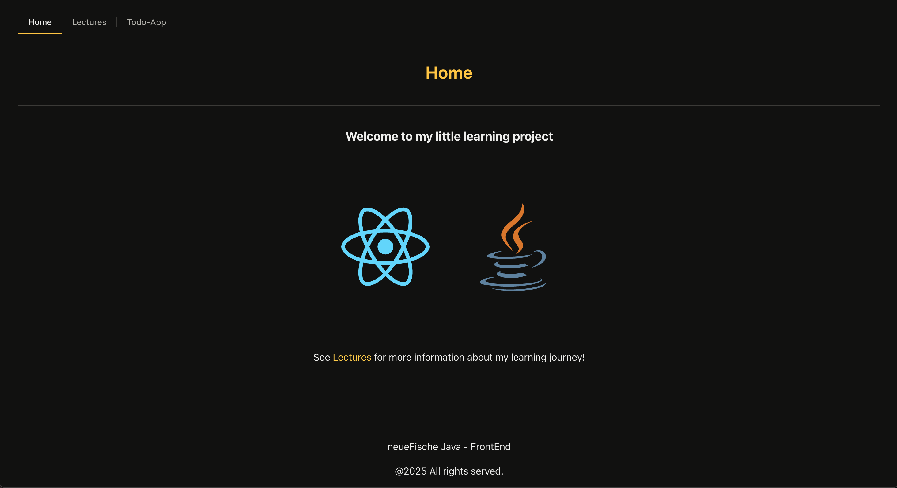
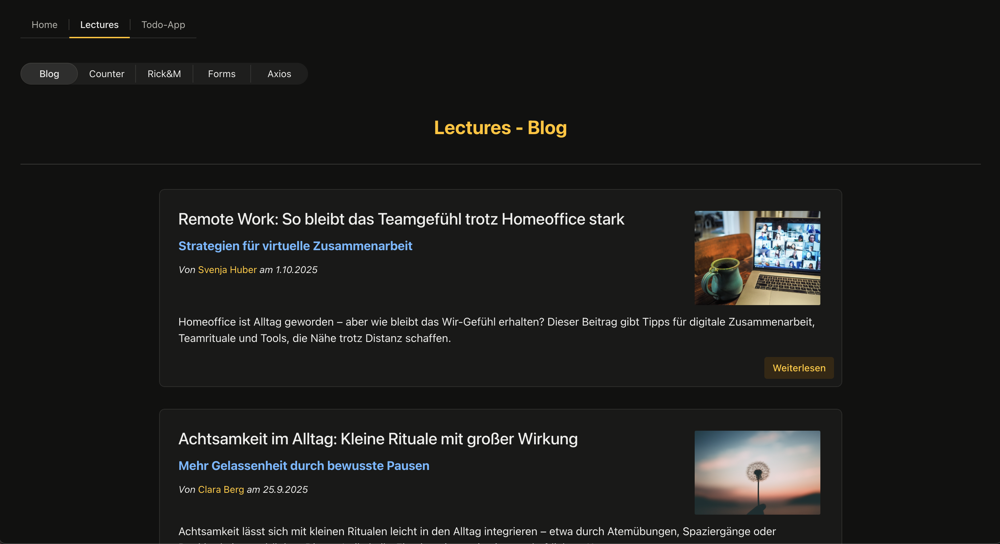
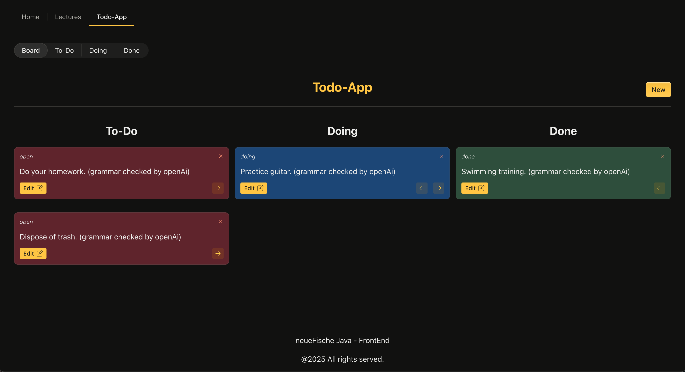

# Overview

In this project there is a front-end built in Vite with React.

You gonna find some lessons and also a Todo-App which integrates with a Java backend API which you can
find [here](https://github.com/JanPSchwarz/Recap-Project-SpringBoot-TodoApp)

## Screenshots

